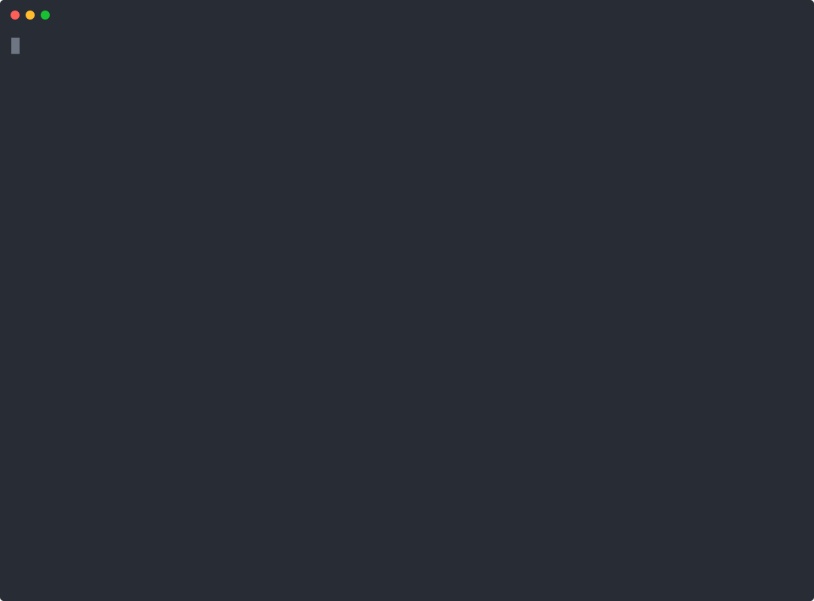

# 🧬 bugvax

**Vaccinate your codebase.** bugvax turns every bug you have ever fixed into an *antibody*: a validated rule that blocks that whole class of bug from coming back, whether a human or an AI agent writes it. It finds the copies of those bugs that are still in your code, and it fixes them with the same fix you already made once.

```bash
npx bugvax learn    # learn from your bug-fix history
npx bugvax fix      # repair every latent copy of those bugs
```

**Website:** [xeniak123.github.io/bugvax](https://xeniak123.github.io/bugvax/) · **Claude Code plugin:** `/plugin marketplace add xeniak123/bugvax` then `/plugin install bugvax@bugvax`

<p align="center">
  
</p>
<p align="center"><sub>A real run on <code>npx bugvax demo</code>: 6 antibodies learned, 6 hidden bugs found, 5 fixed automatically. The 6th has no provable one-line fix, so it is left for a human. Waits for the model are shortened.</sub></p>

You fixed each of those bugs once. bugvax makes sure you never have to fix them again.

---

## Why

- **Agents and people repeat the same mistakes.** The bug you fixed in March comes back in June in another file.
- **`CLAUDE.md` / `AGENTS.md` rules are suggestions.** Agents forget them, and nobody checks that they were followed.
- **AI code review is probabilistic.** It costs tokens on every PR and remembers nothing.
- **Linters ship generic rules.** They know nothing about the bugs *your* project already paid for.

bugvax learns from your git history and compiles each fix into a deterministic [ast-grep](https://ast-grep.github.io) rule. The rule runs in milliseconds, with no AI involved, on every agent edit, every commit and every PR.

## How it works

1. **Mine.** bugvax finds bug-fix commits in your history: `fix:` messages, hotfixes, `fixes #123`, regression tests. It skips the noise: typos, lint, formatting, dependency bumps, test-only changes and huge rewrites.
2. **Generalize.** An LLM turns each fix into an ast-grep rule for the *class* of bug, not just the one line that changed, plus a fix template.
3. **Validate.** This step is what makes the rules trustworthy. A rule is kept only if:
   - ✅ it **matches the buggy code**, on the lines the fix changed;
   - ✅ it **does not match the fixed code**;
   - ✅ it does not light up half the codebase;
   - ✅ a second, independent model call confirms that the rule's matches in today's code are real bugs.

   Every failure goes back to the model as concrete feedback ("your rule still matches the fixed code at line 6…"), for up to 3 attempts. Fixes that are not reusable patterns, such as business logic or changed constants, are skipped instead of forced into a rule.
4. **Prove the fix.** The fix template is kept only if applying it to the buggy code **reproduces what the human fix did**. A template that merely silences the rule is dropped. An example is `tags=[]` → `tags=None` when the real fix also added `if tags is None: tags = []`.
5. **Enforce.** Antibodies are plain ast-grep YAML files in `.bugvax/antibodies/`. You review them like code and commit them. Checks are deterministic and fast, and they run in your agent's hooks, in pre-commit and in CI. **No LLM runs at check time.**

bugvax also avoids duplicates. If an existing antibody already catches a new fix, the fix is marked *covered* and no model call is made.

## Quick start

```bash
npx bugvax learn                  # learn antibodies from your bug-fix history
npx bugvax scan                   # find every latent copy of an old bug
npx bugvax fix --dry-run          # preview the proven fixes, then: npx bugvax fix
npx bugvax init --claude-code     # or --cursor, --gemini, --codex, --mcp, --git-hook
```

Just fixed a bug and haven't committed yet? Learn from it right away:

```bash
npx bugvax learn --working -m "crash when the cart is empty"
```

No bug history yet? Start with a vaccine: validated antibodies for classic bug classes (HTTP calls without a timeout, mutable default arguments, numbers sorted as strings, Express error responses that fall through to `next()`):

```bash
npx bugvax vaccinate              # list vaccine packs
npx bugvax vaccinate starter      # install one, then: npx bugvax scan
```

Want to see it work first? The demo shop's history holds 7 bug fixes across TypeScript, React and Python, and 6 of those bugs are still hiding somewhere else in its code:

```bash
npx bugvax demo && cd demo-shop && npx bugvax learn && npx bugvax fix
```

In our run bugvax learned 6 antibodies and found all 6 hidden bugs, with no false positives. It also skipped the business-logic fix ("apply discount before tax"), which is not a reusable pattern.

## Guard your AI agent

Agents write new code by imitating the code around it, including the copies of old bugs that are still in it. bugvax works at three points:

1. **Before**: at session start the agent gets a short briefing: the bug classes this repository already fixed, and the exact places where known-bad copies still live, so it does not use them as examples.
2. **During**: after every edit, bugvax checks the lines the agent changed and hands any re-introduced bug straight back to it, with the proven fix and the commit where it was fixed before.
3. **After**: before the agent may say "done", bugvax checks everything it changed in the session. Your own uncommitted work from before the session is never blamed on the agent.

### Does it make the agent better?

We measured it: headless Claude Code (Sonnet) got everyday tasks like "add `withdraw()`, like `deposit()`", where the code it imitates still hides a bug the repository fixed elsewhere.

| | runs that brought a fixed bug back, without bugvax | with bugvax |
|---|---|---|
| this project's own conventions (a money helper, an outbox, a tenant filter, …) | 5 / 6 (11 bugs) | **0 / 6** |
| classic bug classes (no timeout, un-awaited commit, …) | 2 / 12 | **0 / 12** |

Every task was still completed, and no run touched an antibody to get past a check. A strong model already knows most generic pitfalls. It cannot know your project's own rules, and those are exactly what bugvax learns from your history. Method, caveats and raw results: [eval/](eval/README.md).

### Claude Code plugin

```
/plugin marketplace add xeniak123/bugvax
/plugin install bugvax@bugvax
```

The plugin installs all three hooks, the bugvax MCP server and a skill that teaches the agent the workflow (check before copying code, learn from every fix it makes). It does nothing in repositories without `.bugvax/`, and it also works when you start Claude Code in a folder that holds several repositories. Prefer project settings that your team shares? `npx bugvax init --claude-code` writes the same hooks and skill into `.claude/`.

### Other agents

| Agent | Setup | How the agent hears about it |
|---|---|---|
| Claude Code | plugin, or `bugvax init --claude-code` | `SessionStart` briefing, `PostToolUse` after every edit, `Stop` before it finishes |
| Cursor | `bugvax init --cursor` | `afterFileEdit` records the agent's files; the `stop` hook gives it a follow-up turn to fix them |
| Gemini CLI | `bugvax init --gemini` | `AfterTool` hook on `write_file` / `replace` |
| Codex | `bugvax init --codex` | `PostToolUse` hook on `apply_patch` |
| Any MCP client | `bugvax init --mcp` | MCP tools (below) |
| Anything else | `npx bugvax context >> AGENTS.md` | the same briefing, as text |

What the agent sees:

```
bugvax: this edit re-introduces 1 bug that was already fixed before.

src/refunds.ts:6  [unawaited-db-commit] db.commit() is not awaited: the commit may reject …
  code: db.commit();
  proven fix: replace `db.commit()` with `await db.commit()`
  why: commit() returns a promise; without await, failures surface after the response …
  history: fixed before in ca73865 "fix: await db commit when refunding orders"

Please fix these before continuing.
```

### MCP server

`bugvax mcp` is an MCP server (stdio), so any MCP-capable agent can consult your bug history *before* it writes code:

| Tool | What it does |
|---|---|
| `check_code` | Check a file, or code the agent is about to write, against every antibody |
| `bug_history` | "What went wrong here before?": the bug classes relevant to a file or topic |
| `scan` | Find latent copies of already-fixed bugs |
| `fix` | Apply proven fixes (with `dry_run`) |
| `learn_from_fix` | Call right after fixing a bug: bugvax turns the uncommitted fix into a new antibody |

`bugvax init --mcp` registers the server for Claude Code (`.mcp.json`) and Cursor (`.cursor/mcp.json`). Other clients use the same command:

```json
{ "mcpServers": { "bugvax": { "command": "npx", "args": ["-y", "bugvax", "mcp"] } } }
```

The server works on the git repository it is started in. Clients with one global config (Claude Desktop, Windsurf, …) should set `"env": { "BUGVAX_ROOT": "/path/to/repo" }`; otherwise bugvax uses the repository of an absolute file path the agent passes, then the client's MCP roots. Relative paths in tool calls are relative to the repository root.

## CI

```yaml
# .github/workflows/bugvax.yml
name: bugvax
on: pull_request
jobs:
  bugvax:
    runs-on: ubuntu-latest
    steps:
      - uses: actions/checkout@v5
      - uses: xeniak123/bugvax@v1
```

Findings appear as annotations right on the changed lines of the pull request. The action checks only changed lines, so an old latent bug elsewhere never blocks an unrelated PR. Without the action: `npx -y bugvax check --base origin/main` (with `fetch-depth: 0`).

## Model backends

bugvax needs a model only while **learning**. `scan`, `check` and `fix` never call a model.

| Backend | When it is used | Notes |
|---|---|---|
| **Claude Code** | default when no API key is set | Uses your Claude subscription through `claude -p`, in a locked-down mode: no tools, no MCP servers, no hooks, no CLAUDE.md. |
| **Anthropic API** | when `ANTHROPIC_API_KEY` is set, or with `--provider anthropic` | Defaults to `claude-opus-5`. Change it with `--model`. |

What the model sees: for each fix it analyzes, the commit message and diff, up to about 25 lines of surrounding code from before the fix, related test changes, and short snippets of today's code where a new rule matches (for the review step). Nothing else in your repository is sent.

A fix usually takes 1–4 model calls. With the Claude Code backend those calls count toward your plan's usage limits, just like your normal sessions, so `--limit` (default 15 fixes per run) keeps each run small. If the backend hits a usage limit, bugvax stops right away. The fixes it could not analyze are left for the next `bugvax learn`, not marked as failed.

## Commands

| Command | What it does |
|---|---|
| `bugvax learn` | Learn antibodies from bug fixes in git history (incremental: only new commits). Useful flags: `--limit`, `--since`, `--commit <sha>`, `--working`, `--dry-run`, `--retry`, `--model`, `--provider` |
| `bugvax scan [paths]` | Find every match of every antibody: latent copies of old bugs |
| `bugvax fix [paths]` | Apply proven fixes to those matches (`--dry-run` to preview) |
| `bugvax check` | Check uncommitted changes. `--staged` for pre-commit, `--base <ref>` for CI, `--hook <agent>` for agents |
| `bugvax context` | Print the agent briefing: known bug classes and where latent copies still live |
| `bugvax vaccinate [packs]` | List or install vaccine packs learned from public projects |
| `bugvax list` | List antibodies and where each one came from |
| `bugvax init` | Create `.bugvax/`. `--claude-code`, `--cursor`, `--gemini`, `--codex`, `--mcp` and `--git-hook` install the integrations |
| `bugvax mcp` | Run the MCP server |
| `bugvax demo [dir]` | Create a demo repository with real-looking bug fixes to try bugvax on |

## What gets stored

```
.bugvax/
  antibodies/unawaited-db-commit.yml   # plain ast-grep rules: review, edit, delete them freely
  config.json                          # provider, model, effort, attempts, exclusions
  state.json                           # which commits were already analyzed
```

Commit the whole folder. Your teammates and your CI then get the same immunity without spending a single model call.

`config.json`:

```json
{
  "provider": "auto",
  "effort": "high",
  "maxAttempts": 3,
  "maxHeadMatches": 10,
  "review": true,
  "exclude": ["**/legacy/**"]
}
```

## Languages

JavaScript and TypeScript (one antibody covers `.js`, `.jsx`, `.ts` and `.tsx`), Python, Go, Rust, Java, Kotlin, Ruby, PHP, C#, Swift, C, C++, Scala, Lua and Elixir: everything ast-grep parses.

## FAQ

**Is this a linter?** It is a linter *generator*. The rules come from your own history, so they catch the mistakes your team and your agents actually make.

**What if an antibody is wrong?** It is a YAML file. Edit it or delete it. Every antibody records the commit it came from, so you can always check why it exists.

**Is `bugvax fix` safe?** It applies only fix templates that reproduced a real human fix during learning. It rescans afterwards, and it prints every change. Review the result with `git diff` like any other change.

**How much does learning cost?** Usually 1–4 model calls per fix, and only once per commit. On later runs bugvax looks only at new history.

**How is this different from AI code review?** Review bots re-read your code with a model on every PR and forget everything afterwards. bugvax spends model calls once, at learning time, and produces rules that are deterministic, free to run, and reviewable in git.

**Prior art?** Meta's [Getafix](https://engineering.fb.com/2018/11/06/developer-tools/getafix-how-facebook-tools-learn-to-fix-bugs-automatically/) learned fix patterns from Facebook's own history but was never released. bugvax brings the idea to every repository and to the age of coding agents.

## Roadmap

- 💉 A larger vaccine registry, plus remote packs (`bugvax vaccinate owner/repo`)
- GitHub App that comments on PRs with the history of each re-introduced bug
- Learning from merged PRs labeled `bug`, and from linked issues

## Development

```bash
npm install
npm test           # unit + integration tests (real git repos, real ast-grep, a real MCP client)
npm run dev -- learn --dry-run
npm run build
```

Releasing: `npm version patch && git push --follow-tags`. The release workflow builds and tests without any credentials, publishes the tested tarball to npm with provenance, creates the GitHub release and moves the `v1` action tag. See [CHANGELOG.md](CHANGELOG.md).

Agent eval: `node scripts/eval-agents.mjs --suite ledger --trials 2 --model sonnet` (runs `claude -p`, so it uses your Claude plan).

## License

MIT
